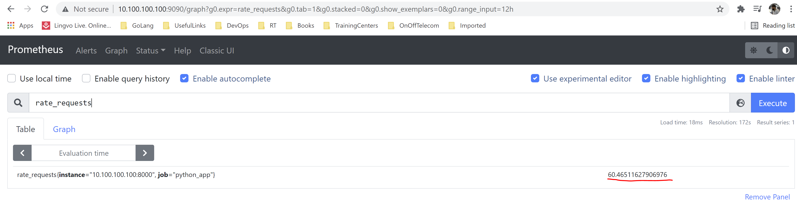
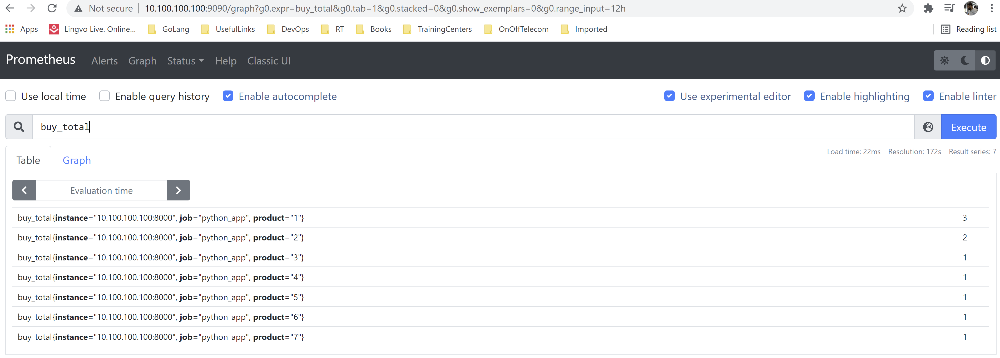
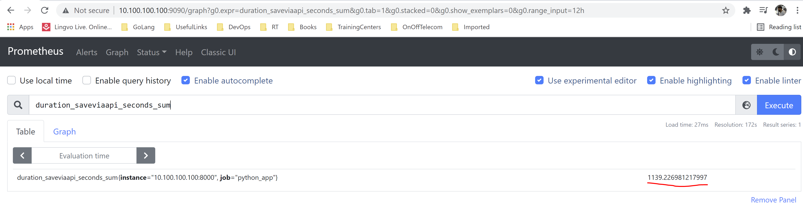
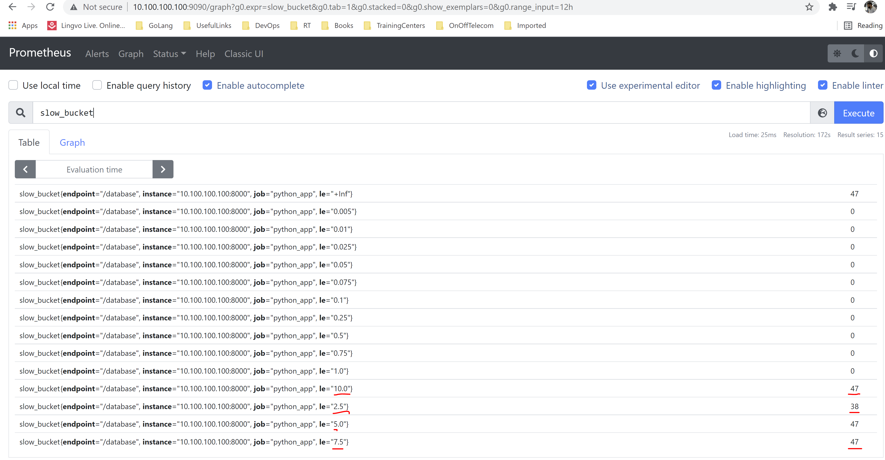
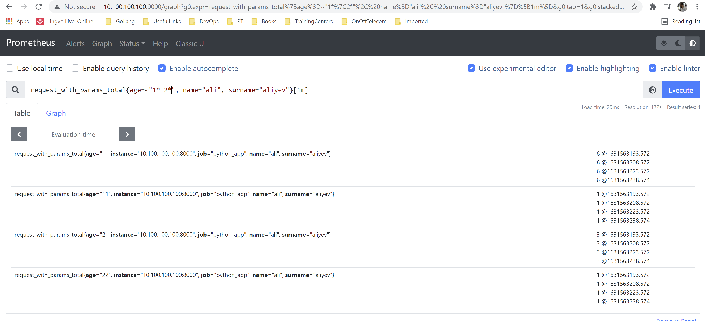

# Prometheus metrics and logging with Python Flask

## requirements

[](https://www.python.org/downloads/release/python-360/)

[](https://pypi.com/project/pip)


### The main purpose of these code files is to show how to use python `prometheus_client` library to prepare metrics which will be collected from [`prometheus`](https://github.com/prometheus/prometheus/releases/download/v2.29.2/prometheus-2.29.2.linux-amd64.tar.gz) application. You can find a lot of information about prometheus from google or from [`official page`](https://prometheus.io/docs/introduction/overview/). I have created log structure for the simple python app like as template too.

### How it works

- `app.py` - Main file which starts Flask application to listen `10.100.100.100:8000` and loading http endpoints to initalize (Initalizing flask instance with predefined logging structure with `after_request` method).
- `decorate_response.py` - Prepares stucture for the logging in file which, will be created at start time of the `app.py` file in the `output` directory.
- `endpoints.py` - File contains all http endpoints with some logic to test `prometheus` metrics.
- `flask_logs.py` - Used to define logging configurations for flask instance. I will use `file` type logging.
- `useful_funcs.py` - If we want to test different type of logging level just use `return_mutliple_type_logs` method inside of http endpoint.
- `variables.py` - Stores all variables used for our endpoints and metrics

#### Four types of metric are offered: `Counter`, `Gauge`, `Summary` and `Histogram`. See the documentation on [`metric types`](https://prometheus.io/docs/concepts/metric_types/) and [`instrumentation best practices`](https://prometheus.io/docs/practices/instrumentation/#counter-vs-gauge-summary-vs-histogram) on how to use them

#### Start `app.py` with the int argument(range between `1 100`) to generate internal `500` error which will helps us stimulate gauge metrics

```bash
$ python3 app.py 50
```

**Note**: Server IP address where I am testing all these code files is `10.100.100.100`

#### In the different terminal download [`prometheus`](https://github.com/prometheus/prometheus/releases/download/v2.29.2/prometheus-2.29.2.linux-amd64.tar.gz) binary file for linux and start with the following configurations

```bash
$ wget https://github.com/prometheus/prometheus/releases/download/v2.29.2/prometheus-2.29.2.linux-amd64.tar.gz && tar zxf prometheus-2.29.2.linux-amd64.tar.gz && cd prometheus-2.29.2.linux-amd64
$ cat <<'EOF' > prometheus.yml
global:
  scrape_interval:     15s
  evaluation_interval: 15s

alerting:
  alertmanagers:
  - static_configs:
    - targets:
       - alertmanager:9093

rule_files:
  - "rules/linuxrules.yml"
  - "rules/windowsrules.yml"
  - "rules/webrules.yml"

scrape:
scrape_configs:
  - job_name: 'prometheus'
    static_configs:
    - targets: ['10.100.100.100:9090']
  - job_name: 'python_app'
    static_configs:
    - targets: ['10.100.100.100:8000']
EOF
$ ./prometheus --config.file=prometheus.yml --web.enable-lifecycle
```

#### After execution of `curl_code.sh` script will be generated `prometheus` metrics of `Summary`, `Gauge`, `Histogram` and `Counter` types

- `Counter` - types metrics `view_total` and `buy_total`
- `Gauge` - type metrics `rate_requests` and `requests_created`
- `Summary` - type metrics `duration_getlang_seconds_sum`, `duration_saveviaapi_seconds_sum`
- `Histogram` - type metrics `slow_bucket`, `slow_count`, `slow_sum`

```bash
$ ./curl_code.sh
```

We can go open `http://10.100.100.100:9090/` page to check metrics:











#### If you want to clean your workspace from `__pycache__` folder then add the following alias to `~/.bashrc` file

```bash
$ alias pyclean='find . \( -type f -name "*.py[co]" -o -type d -name "__pycache__" \) -delete && echo "Removed pycs and __pycache__"'
```
